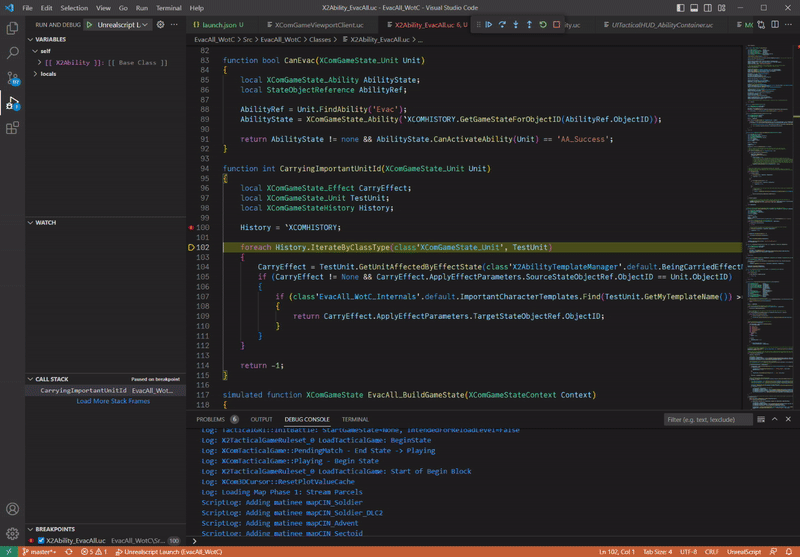

[](https://github.com/tracktwo/unrealscript-debugger/actions/workflows/ci.yaml)

# Unrealscript Debugger Adapter

A debugger adapter to support debugging Unrealscript in any editor that understands
the [Debug Adapter Protocol](https://microsoft.github.io/debug-adapter-protocol/)
such as VS Code, [Neo]Vim, Emacs, etc.



## Installation

Installation instructions depend on the editor you are using. Installation has
two parts: the _adapter_ and the _interface_.

The _adapter_ is the component that talks to your editor and must be installed once per editor.
For VS Code this comes as an extension.

The _interface_ is the component that talks to the specific game you want to debug
and must be installed once per game. The VSCode extension has commands to simplify
installing the interface, but for other editors this must be done manually.

### VS Code Installation

#### Install the extension
Download the .vsix package from the releases tab and install with
`code --install-extension path\to\package.vsix`. Restart VS Code.


#### Install the debugging interface in game(s)

The debugging interface needs to be installed to the game folder of each game
you wish to debug. The extension provides a command to help install this file.

Under `View -> Command Palette` (`Ctrl+Shift+p`) enter `Unrealscript` into the
search box and run the `Unrealscript Debugger: Install Unrealscript Debugger
Interface` command. This will prompt you to choose either 32-bit or 64-bit and
then select the binaries folder of the game. The folder to choose is the one
that has the executable for the game you want to debug. This will need to be
reinstalled whenever the extension is updated, and the debug console will tell
you if the interface is out of date.

For example, for a default Steam install of XCOM2: War of the Chosen select the
64-bit interface and then nagivate to:

`C:\Program files (x86)\Steam\steamapps\common\XCOM 2\Xcom2-WarOfTheChosen\Binaries\Win64`

### Other Editors

Installation will be editor specific. Download the installation package and
copy `win64\adapter.exe` to your favorite location. Copy
`win32\DebuggerInterface.dll` or `win64\DebuggerInterface.dll` to a game's
binary folder depending on whether it is a 32 or 64 bit game. Configure the
editor to run `adapter.exe` as the debug adapter.


## Configuration

After installation you must add _debugger configurations_ that tell the debugger
how to debug your project.

### VS Code

VS Code configuration is done with a standard `launch.json` file like any other
debugger. This can be created or editted by clicking the _Run and Debug_ tab in
VS Code then clicking the gear icon to configure. An example `launch.json` that
defines two configurations is shown below:

```
{
    "version": "0.2.0",
    "configurations":[
        {
            "name": "Unrealscript Launch",
            "request": "launch",
            "type": "unrealscript",
            "sourceRoots": [
                "${workspaceRoot}\\MyModDir\\Src",
                "C:\\Path\\To\\Game\\SDK\\Development\\Src"
            ],
            "program": "C:\\Path\\To\\Game\\Binaries\\Win64\\Game.exe",
            "args": ["-allowConsole", "-noStartUpMovies", "-review", "-noRedScreens", "-noSeekFreeLoading"],
        },
        {
            "name": "Unrealscript Attach",
            "request": "attach",
            "type": "unrealscript",
            "sourceRoots": [
                "${workspaceRoot}\\MyModDir\\Src",
                "C:\\Path\\To\\Game\\SDK\\Development\\Src"
            ]
        }
    ]
}

```

Custom config variables can be defined in `settings.json` and referenced from
the launch configuration by `${config:<setting_key>}` to simplify setting paths.

#### Common Settings

Each configuration must have the following:

* `name`: An arbitrary string to name this configuration. Shown in the editor.
* `request`: Either `launch` or `attach`. Indicates whether the debugger should
  launch a program to be debugged or attach to an already-running game.
* `type`: `unrealscript`. Indicates the debugger type to use and must be the string
  `unrealscript`.
* `sourceRoots`: Paths to source files. See the `Source Roots` section below.

The following configuration settings are optional:

* `logLevel`: A string for the log level to use for internal debugger logging.
  Can be one of `error`, `warn`, `info`, `debug`, or `trace`. Defaults to
  `warn`. By default logs are written to `%TEMP%\unrealscript-debugger\`.

#### Source Roots

The `sourceRoots` setting is required for both launch and attach requests, and
is an array of strings. The setting tells the debugger where to find
Unrealscript source files. Typically this will include some subfolder of your
workspace for your own sources, and possibly a game SDK directory with stock sources
for the game.

Entries in this list should point to a directory (often named `Src`) that has
a particular directory structure that matches Unrealscript's convention:

```
* Src
    |
    ` Package
    |   |
    |   ` Classes
    |       |
    |       ` Class1.uc
    |       ` Class2.uc
    ` AnotherPackage
        |
        ` Classes
            |
            ` Class3.uc
            ` Class4.uc
```

The `Src` folder has directories for each Unrealscript _package_. Under each package
directory is a `Classes` subdirectory, and inside `Classes` are individual source files.

The debugger will locate the source file for a particular class with name `Package.ClassName`
by searching each entry in the source roots array in order until it finds an entry with a
file that matches the name `{source_root_entry}\Package\Classes\ClassName.uc`.

#### Launch-specific options

With the `launch` request type the debugger will load the game and
automatically enable debugging with the `-autoDebug` option when you start
debugging. This supports the following additional options:

* `program`: A string with the full path to the game executable to run.
* `args`: An array of strings with the arguments to pass to the game
  executable. You do not need to add `-autoDebug` to this list, it is added
  automatically for launch requests.
* `port`: The port number to use for communication between the adapter and
  debug interface. Only necessary if the default port doesn't work for you.
* `autoResume`: A boolean. If true the debugger will auto-resume from the first
  implicit stop event that the game injects when using `-autoDebug`.

### Other Editors

The configuration will be editor-specific. Some DAP implementations (like neovim-dap)
support reading a VS Code launch.json file. Otherwise you will need to define
some configuration structure using the configuration keys shown above.

## Advanced Configuration

The debugger supports some environment variables that can be set to change behavior.

* `UCDEBUGGER_PORT`: The port number to use for communication between the adapter
  and interface. This will be overridden by the launch `port` option if present.
* `UCDEBUGGER_LOGDIR`: Directory in which to write logs.
* `UCDEBUGGER_LOGLEVEL`: The log level to use by default. This will be overridden by
the launch `logLevel` option if present and accepts the same values.

